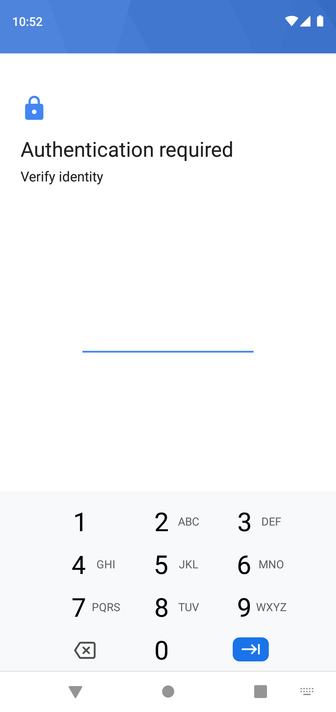
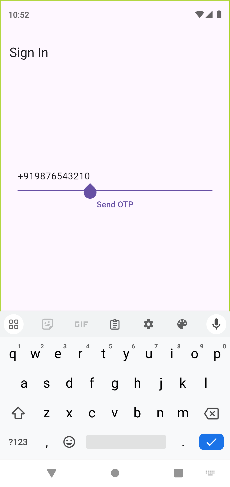
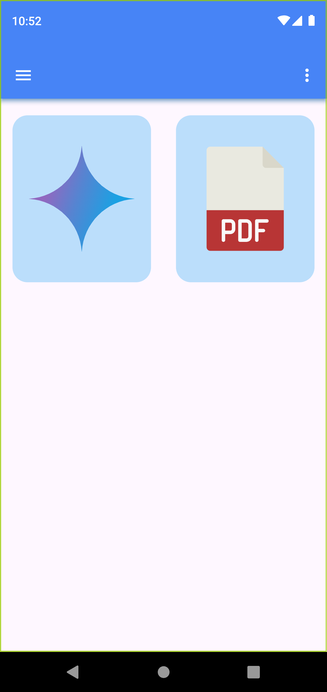
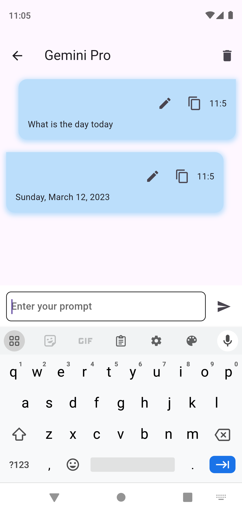

# gemini_app

A new Flutter project.

v0.1.0:
 - It only has the gemini chat window to chat with gemini

v0.2.0:
 - UI has improved
 - pdf generator has added
 - firebase removed

v0.3.0:
 - whatsapp status saver merged
 - app drawer is functioning
 - todo application is merged
 - local auth added ( including biometric )

v0.3.1:
 - the debug console was giving error, needed to add default material localization for biometric authentication has been fixed

##Features:

1. Authentication:
  - The local auth system verify the user using biometric and screen lock
  - The below screenshot is given for the screen used in the application

  - 

  - The sign in method using itp verification is implemented
  - The user need to login using the phone number

  - 

2. Homepage:
 - The homepage has the tile to access all the tools in the application
 - The user currently has two optins like gemini and df generator
 - The UI is so simple and easy

  - 

3. Gemini:
 - The first tile in the application represents the gemini chatting feature
 - The chatting interface for chatting with the gemini in this application
 - It is able to access the internet and answer the questions using gemini

 - 

4. PDF:
 - The second tile in the application represents the PDF generator
 - The application able to create PDF files with different images
 - Clicked images are collected from the gallery and then it creates the PDF file

 - 